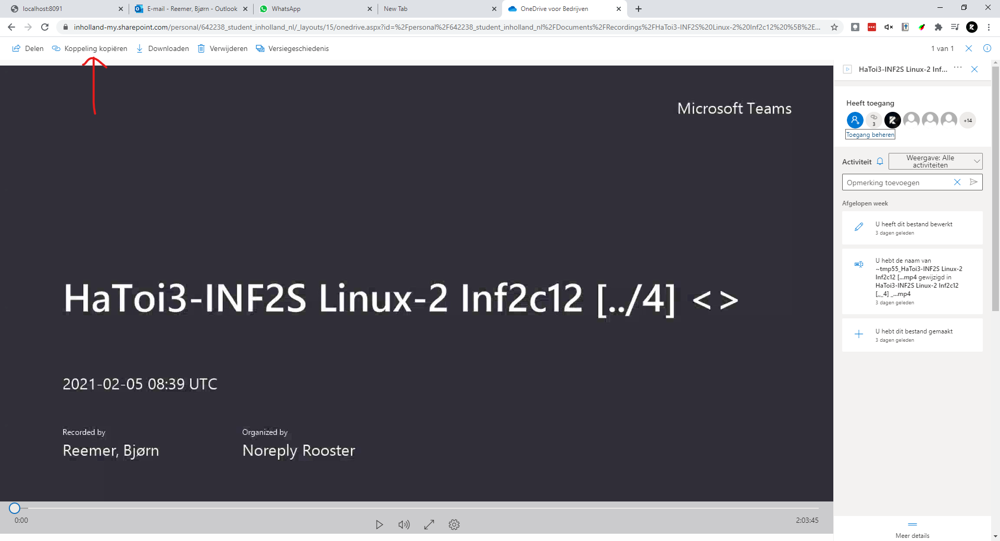
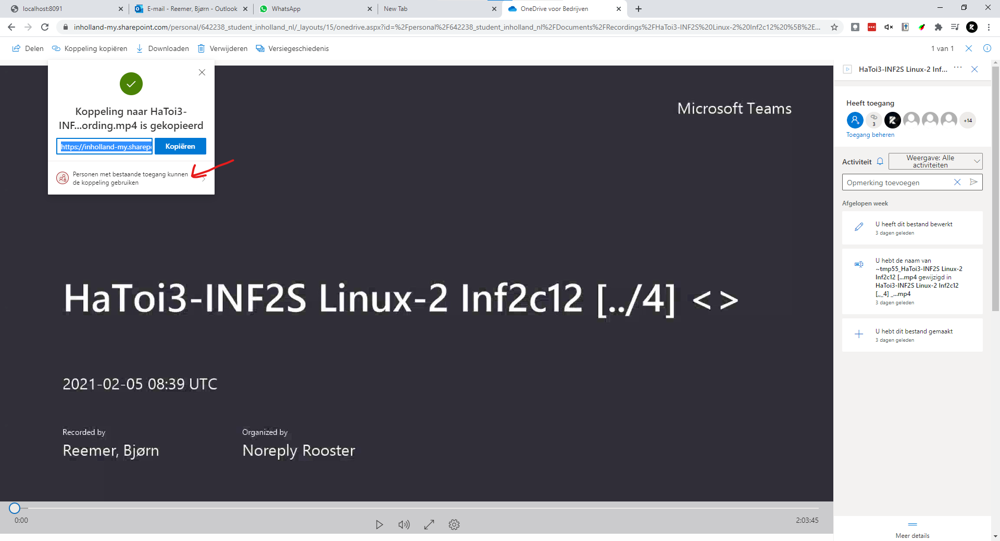
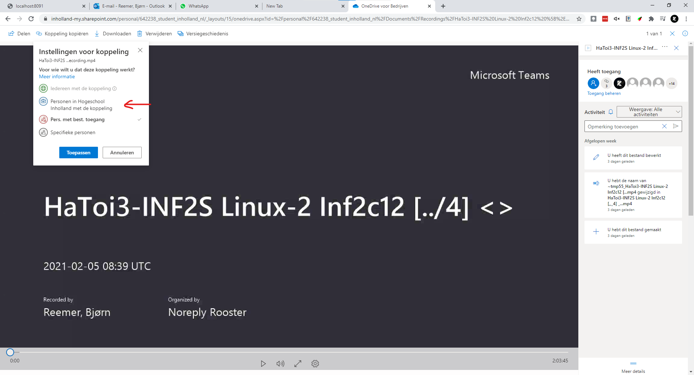
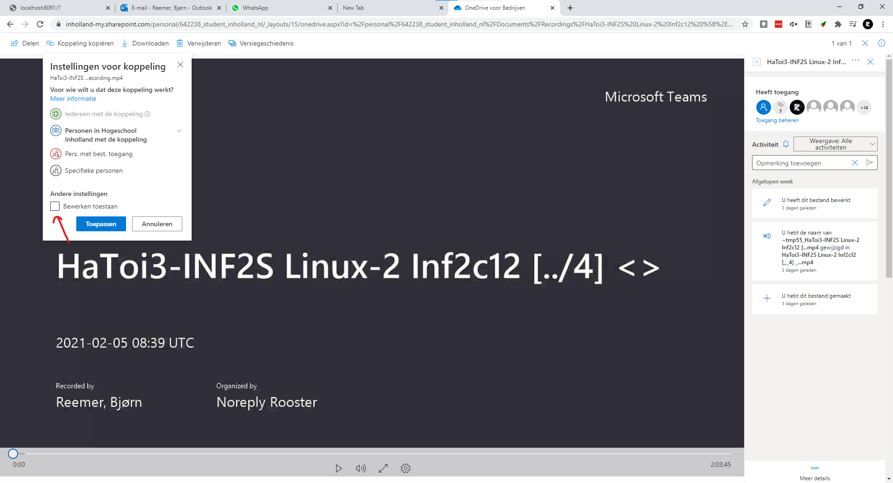
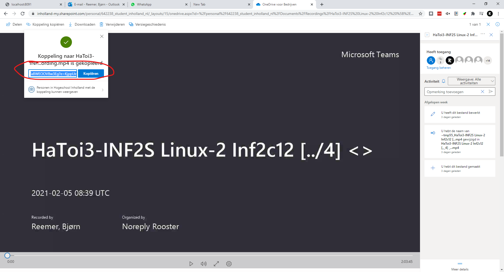

## Zet de recording open voor iedereen

### Stap 1

Ga naar de meeting die je heb opgenomen en open de opnamen. Als je op dit scherm bent moet je op "Koppeling kopieren" klikken.

### Stap 2

Klik dan op de onderste knop zoals hieronder aangegeven.

### Stap 3

Selecteer dan "Personen in Hogeschool Inholland met de koppeling"

### Stap 4

Zorg ervoor dat "Bewerken toestaan" uit staat. Klik dan op "Toepassen"

### Stap 5

Kopieer nu de link die verschijnt een paste hem in de meeting chat zodat iedereen erbij kan. Als je er niet uit komt moet je mij (Bjørn) maar even appen of mailen via (642238@student.inholland.nl).

