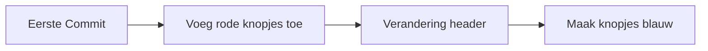
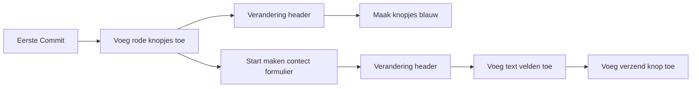
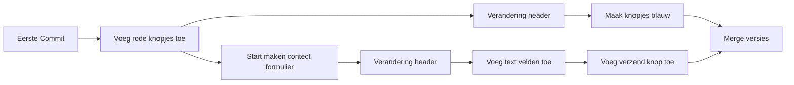
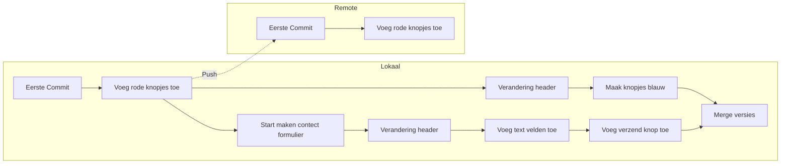

# Git Gud

[Hoe dit eigenlijk allemaal werkt](subtitle)

[toc]

## Introductie

Veel code wordt geschreven met behulp van git (dit is niet GitHub, maar daar kom je later wel achter). Git is een versioning system. Je gebruikt het om de veranderingen in de code bij te houden. Dit zorgt ervoor dat je niet je code hoeft te kopieren naar een andere map om je oude versies bij te houden.

## Het concept

Je code bestaat uit verschillende veranderingen die meestal met elkaar te maken hebben, namelijk je heb net een deel van de homepagina afgemaakt. Je houd deze veranderingen bij in 'commits'. Een commit is niets meer dan een versie in je code die allemaal veranderingen bijhoud. Als je bijvoorbeeld een homepage heb kan je een eerste commit hebben (ook wel de initial commit genoemd) waarin je met de homepage begint en veranderingen zoals het aanpassen van de header. Deze worden vaak op een soort timeline gezet. Hier zie je het begin van het project en de veranderingen die er zijn doorgevoerd.

Een ander concept van git zijn de branches (de takken). Branches zijn afgesplitste tijdlijnen waar je meerdere commits kan hebben. Branches gebruik je om ervoor te zorgen dat code die nog niet af is wordt gescheiden van de code die al wel af is. Ook zie je vaak dat ieder persoon die aan een project werkt een eigen branch heeft waar hij zijn code in schrijft.

Zoals je kan zien zijn er nu twee branches (tijdlijnen). Maar zoals de situatie nu is is het dat er twee versies zijn van dezelfde homepage, namelijk een waar de knopjes blauw zijn en een waar de knopjes nog rood zijn want de verandering waar de knopjes blauw worden gemaakt staat op een andere branch. Om de veranderingen weer bij elkaar te voegen doen we een zo geheten 'merge'. Dit zorgt ervoor dat alle veranderingen samen worden gevoegd tot één versie van de website. Dit is zelf dan ook weer een commit.

Maar we kunnen zien dat er twee versies zijn van hetzelfde deel van de homepage, namelijk er zijn twee individuelen veranderingen gemaakt aan de header. Dit noem je een merge conflict en komt voor wanneer er twee versies van dezelfde code zijn. Git zal de verschillende stukken code in het bestand zetten waarna je dan zelf moet kijken wat de goede versie is.

Tot nu toe hebben we alleen nog maar het gehad over git als je het lokaal draait, maar meestal gebruikt je git met iets als GitHub. Zoals het nu is zijn alle veranderingen nog lokaal, maar eigenlijk wil je ze ook ergens ander hebben zoals online. Dit noem je een remote. Een remote is een aparte git instantie (ook wel een repo genoemd) waar je code naartoe gaat om ervoor te zorgen dat het niet alleen op jou computer staat, maar ook op andermans computer kan komen te staan. Als je een remote toevoegt aan een git repo, dan zal er nog niets gebeuren. De situatie zal precies hetzelfde zijn als ervoor. Je moet je commits namelijk 'pushen'. Pushen is eigenlijk niets meer dan je code uploaden naar de remote. Pullen is wanneer je code download van de remote.

