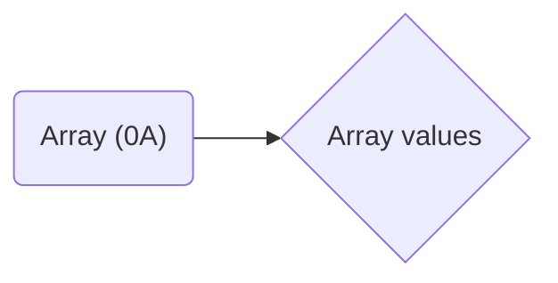

# Lecture 5.1 - Arrays

[TOC]

## Arrays

* "normal" variables can only hold one value.
* Arrays can hold multiple values of the same type.

An array with a length of 5, has an index of 0 to 4.

| Index | 0    | 1    | 2    | 3    | 4    |
| ----- | ---- | ---- | ---- | ---- | ---- |
| Value | 1    | 2    | 3    | 4    | 5    |

So to get the 3rd value of this array, you would look at index $3 - 1 = 2$.

```c#
// Decleration of a variable
int number;

// Decleration of an array
int[] numbers;
```

> ###### Sidenote
>
> Technically, an array is also a variable.

> ###### Sidenote
>
> In the next period (2) we will look at 2 dimensional arrays.
>
> ```c#
> int[,] grid
> ```

To get an value from an array, you would type

```c#
int[] row;
row[<index>];
```

> ###### Sidenote
>
> ```c#
> int[,] grid;
> grid[1,2];
> ```

To create a new array, you would type `int[] row = new int[<length>]`. Length is not zero based. So to get an array with a length of 4 (with a max index of 3) you would just type.

```c#
int[] row = new int[4];
```

### Code example

```c#
int[] numbers = new int[10];
string numbersText = " ";

for (int i = 0; i < number.Length; i++) {
    numbers[i] = i;
}

for (int i = 0; i < numbers.Length; i++) {
    numbersText += numbers[i] + " ";
}

Console.WriteLine(numbersText);
```

> ###### Sidenote
>
> To loop though an array, you can also use `foreach`:
>
> ```c#
> foreach (int number in numbers) {
>     numbersText += number + " ";
> }
> ```

> ###### Sidenote
>
> A `long` variable is just like an `int` but can hold more values because it's `64 bit` based, not `32 bit` based.

### Practice 1

```pseudocode
monthlySalery <- array[12]
sum = 0

for i = 1 to 12
	read saleryThisMonth
	monthlySalery[i - 1] = saleryThisMonth
	sum = sum + saleryThisMonth

average = sum / 12

for i = 1 to 12
	if i > average
		display monthlySalery[i - 1]
```

```c#
double[] monthlySalery = new double[12];
double average;

for (int i = 0; i < monthlySalery.Length; i++) {
    monthlySalery[i] = double.Parse(Console.ReadLine());
}

average = monthlySalery.Average();

foreach (double salery in monthlySalery) {
    if (salery > average) {
        Console.WriteLine(salery.ToString());
    }
}

Console.ReadKey();
```

> ###### Sidenote
>
> An array has some methods attached to it which can be used to simplify your code. For example:
>
> | Method  | Description                                                  |
> | ------- | ------------------------------------------------------------ |
> | Average | Gets the average of an array with numbers in it. ($\frac{1 + 2 + \dots + n}{n}$) |
> | Sum     | Gets the sum of the values within the array ($1 + 2 + \dots + n$) |

> ###### Sidenote
>
> When dividing two `ints` with each other and you want an double, you can do
>
> ```c#
> double average = (double)total / profit.Length;
> ```
>
> Here we use `(double)` to temporary convert `total` to type `double`.

### Practice Dice

```c#
int[] thrownValues = new int[6];
Random rnd = new Random();

for (int i = 1; i <= 6000; i++) {
    // We use 7 instead of 6 because the range is 1-6
    int randomOutput = rnd.Next(7);
    thrownValues[randomOutput - 1] += 1;
}

for (int i = 0; i < thrownValues.Length; i++) {
    Console.WriteLine($"Er is {thrownValues[i]} keer {i + 1} gegooit");
}

Console.ReadKey();
```


## Memory of variables

All variables are stored in something called the `stack`.

| Reference  | Value      |
| ---------- | ---------- |
| 0xBE8A0D40 | 0x00000000 |

```c#
int age
```

Changing the variable to for example `10` changes the value on the `stack`

| Reference  | Value      |
| ---------- | ---------- |
| 0xBE8A0D40 | 0x0a000000 |

Or an `double` and uses two references. In this case `0xBE8A0D44` and `0xBE8A0D48`.

| Reference  | Value      |
| ---------- | ---------- |
| 0xBE8A0D40 | 0x00000000 |
| 0xBE8A0D44 | 0x00000000 |
| 0xBE8A0D48 | 0x00000000 |

You also have the `heap`, this is where `arrays` and `objects` life with their values.

Creating an array creates an reference on the `stack`. Then when you set an value in the array, you change a value on the `heap` that has that reference of the array.

