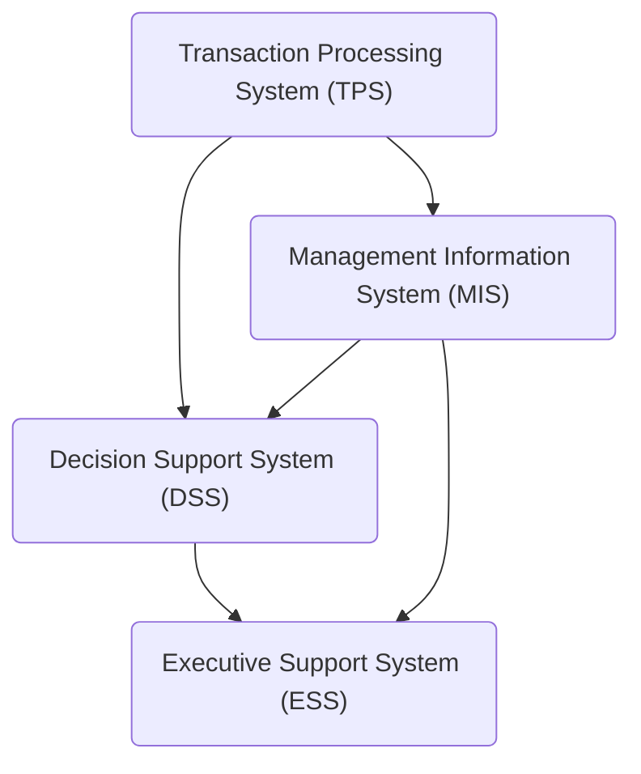

# Information System Flow

```mermaid
graph TB
	tps("Transaction Processing System (TPS)")
	mis("Management Information System (MIS)")
	dss("Decision Support System (DSS)")
	ess("Executive Support System (ESS)")
	
	tps --> mis
	tps --> dss
	mis --> dss
	dss --> ess
	mis --> ess
```

TPS -> MIS -> DSS -> ESS