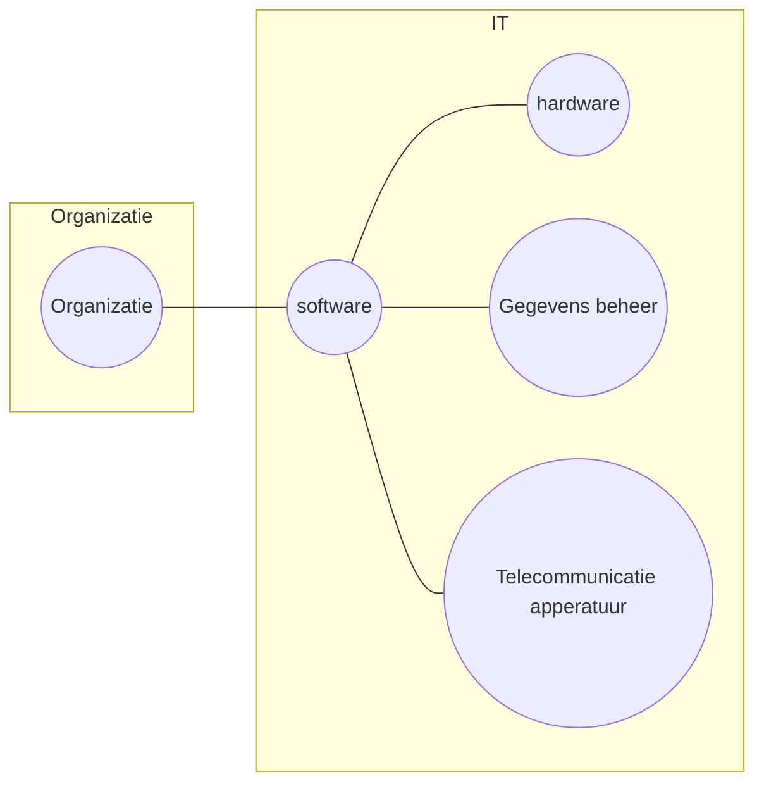

# Lecture 2.1 - Hoofdstuk 1

[toc]

## Invloed informatiesystemen bedrijven.

Groei in e-commerce zoals

* Webshops
* Mobile platforms
* Advertenties
* Sociale media
* Pakketdiensten

IT wordt steeds een groter deel van de uitgave van een bedrijf.

## Nieuw in MIS

### Technologie

* Cloud computing + SaaS
* Big Data
* Mobile platform

### Management

* Gebruik social media
* Meer toepassingen BI (business intelligence)
* Meer virtueel vergaderen

### Organisaties

* Sociaal ondernemen
* Toename telewerken (als werknemer hoef je niet meer altijd op kantoor te zijn)
* Co-creatie bedrijfswaarde (samen maken van software, gemeenschappelijke verantwoordelijkheid)

## Globalisering

* Productie verplaatst naar lage loon landen.

## Digitale onderneming

* Time shifting / space shifting: bvb support zal komen uit de tijdzone waar het dag is. Als je s'nachts een probleem hem, krijg je waarschijnlijk iemand uit een tijdzone waar het dan licht is.

## Opdracht 1

* Netflix
* Post
* Boodschappen
* Security
* Games
* NS
* DigiD

## Informatie systemen

## Informatie systemen

* Operationeel excelleren
* Nieuwe producten, diensten en bedrijfsmodellen
* Band met klant en met leverancier verbeteren
* Verbeterde besluitvorming
* Concurrentievoordeel
* "Overleven"

## Informatie

* Gegevens (data)
* Informatie: Data in de juiste context

## Informatie systemen onderdelen

### ICT Infrastructuur

Hardware, maar ook mainframes, data centers.

### Management

Gaat over productie, wat er wanneer moet gebeuren etc.

# Hoofdstuk 2

## Niveau's

* Strategies niveau
* Management niveau
* Operationeel niveau

## Type informatie systemen

### TPS (Transport Processing System)

* Operationeel niveau

### MIS (Management Informatie Systemen)

* Between strategies- and management niveau

### EIS (Executive Information System)

* Strategies niveau

### ESS (Executive Support System)

Help hoger management vragen zoals te beantwoorden:

* Hoe ziet de arbeidsmarkt er over 5 jaar uit.