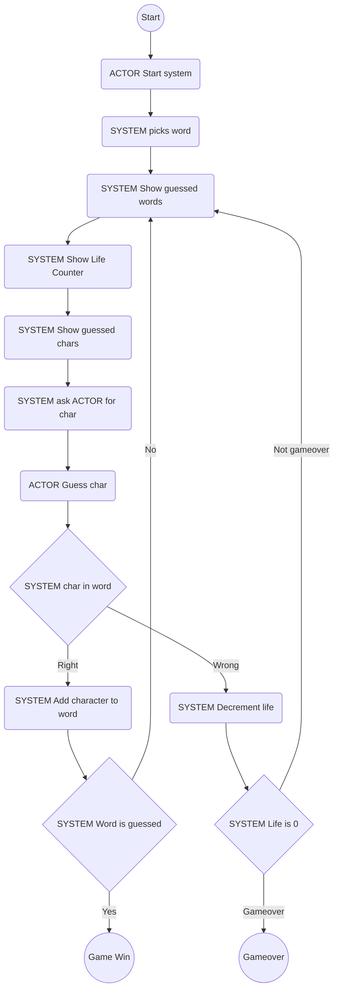

# Lecture 2.3

[toc]

## Flow Diagram

### Parts

| Name                   | Description                                      |
| ---------------------- | ------------------------------------------------ |
| Initial Node           | Start of flow diagram                            |
| Final Node             | End of flow diagram. There may be more than one. |
| Activity Node          | Shows an activity                                |
| Decision or Merge Node | Allows the flow to diverge or merge.             |
| Guards                 | The labels from a decision node.                 |
| Activity Edges         | The arrows in the flow diagram.                  |

### Exercise

