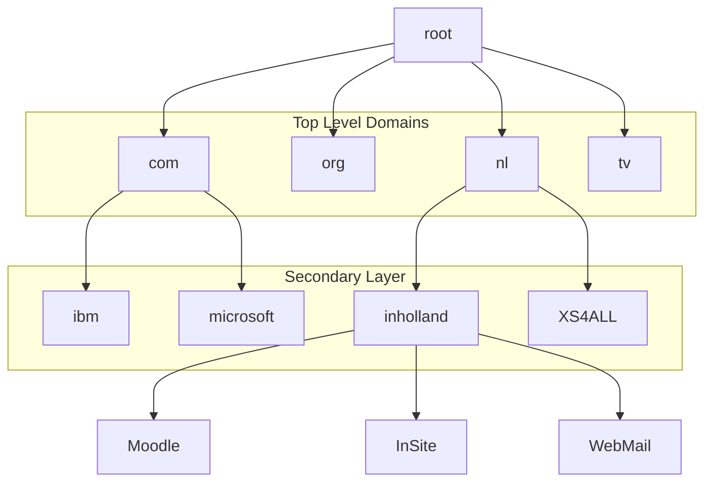

# Chapter 10 - Application Layer

[TOC]

## Application layer parts

| Part                           | Description                            |
| ------------------------------ | -------------------------------------- |
| Application Layer              | Closest to end user                    |
| Presentation and session layer | Format data, compress and encrypt data |

## DNS (Domain Name Service)

* IANA = ip addressen
* ICANN = namen

### ICANN

ICANN has root domain `.`.



| Layer             | Example                 |
| ----------------- | ----------------------- |
| ICANN             | .                       |
| Top level domains | com, org, nl, tv etc... |

A server keeps track of the addresses of the layer beneeth using a `DNS` server.

A request from IBM to `moodle.inholland.nl`.

```sequence
Client -> IMB DNS: Search for moodle.inholland.nl
note over IMB DNS: Not found on this server
IMB DNS -> Root Server: Search for moodle.inholland.nl
Root Server --> IMB DNS: Not found, but found .nl
IMB DNS -> NL DNS: Search for moodle.inholland.nl
NL DNS --> IMB DNS: Not found, but found inholland.nl
IMB DNS -> Inholland: Search for moodle.inholland.nl
Inholland --> IMB DNS: Found moodle.inholland.nl, send data from moodle.inholland.nl
IMB DNS --> Client: Send data from moodle.inholland.nl
```

