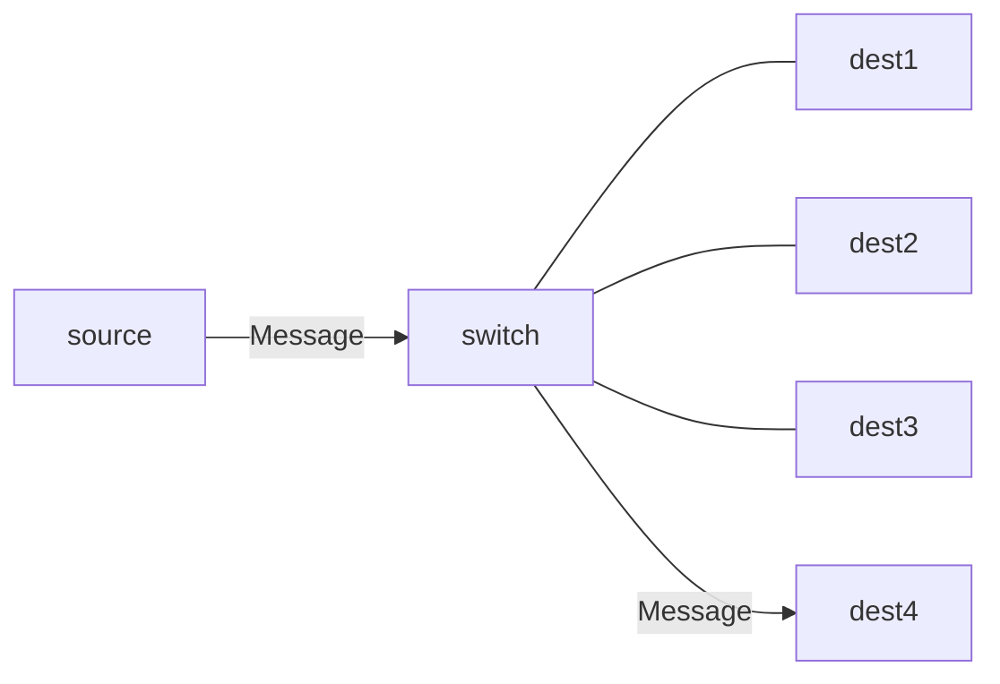
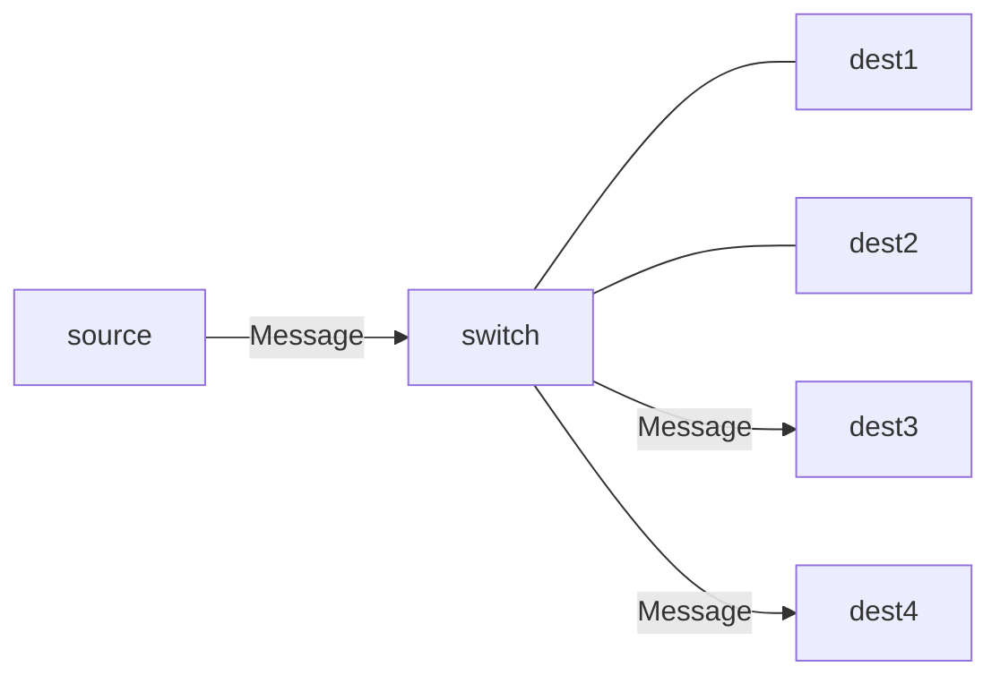
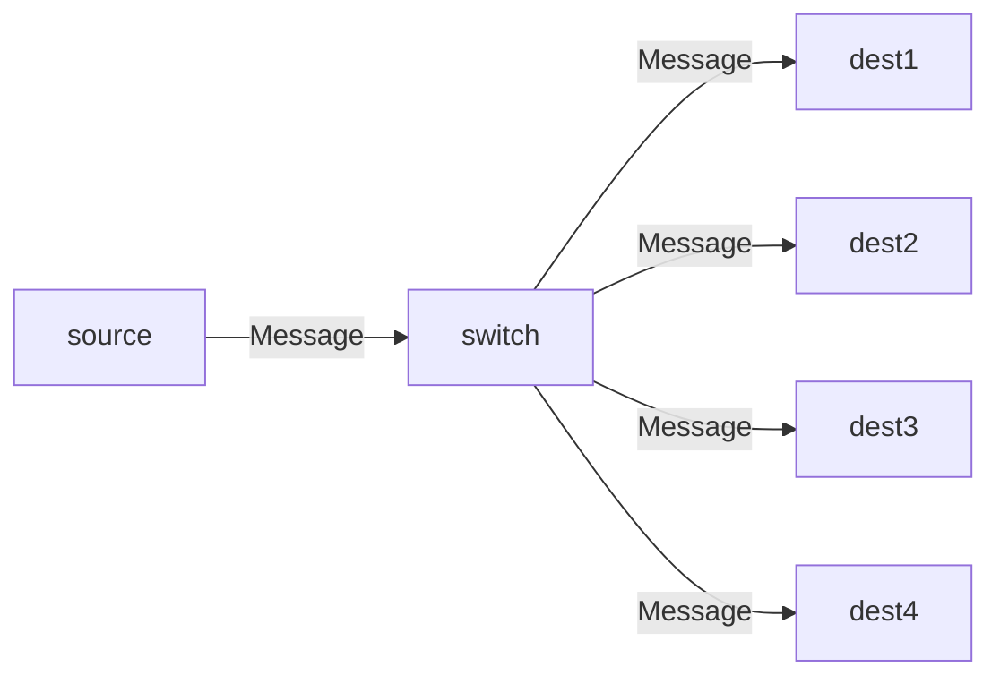

# Chapter 3 - Protocols and Communication

[TOC]

## Message Delivery Options

### Unicast

Using unicast, you talk to exactly one destination.

### Multicast

Using `multicast` you talk to multiple destinations

### Broadcast

When a `broadcast` is send, every end device on the network recieves the message.

## Reference Models

| Layer | OSI          | TCP/IP Model   |
| ----- | ------------ | -------------- |
| 7     | Application  | Application    |
| 6     | Presentarion | Application    |
| 5     | Session      | Application    |
| 4     | Transport    | Transport      |
| 3     | Network      | Internet       |
| 2     | Data Link    | Network Access |
| 1     | Physical     | Network Access |

