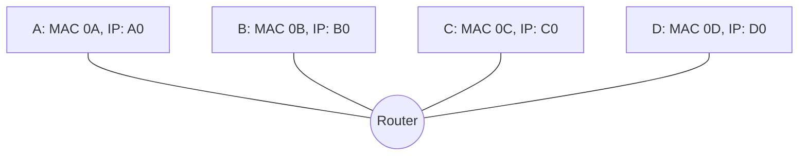

# Chapter 5 - Ethernet

## Switch

A switch allows connected devices to talk to each other without collisions and full duplex.

## ARP

ARP works by asking a IP address for their MAC address by broadcasting to the whole network with a specific IP address.



In this example, `Host A` want's to know the MAC address of  `Host C`. It does this by broadcasting an ARP request with the IP address of `Host C` (in this case 'C0') and `Host C` then responds with the MAC address.

```sequence
Host A -> Host C: ARP using the IP address of Host C
Host C --> Host A: Sends back the MAC address of Host C
```

`Host A` notes down the MAC address of `Host C` for later use so it doesn't have to send an ARP request every time it needs the MAC address of `Host C`.


