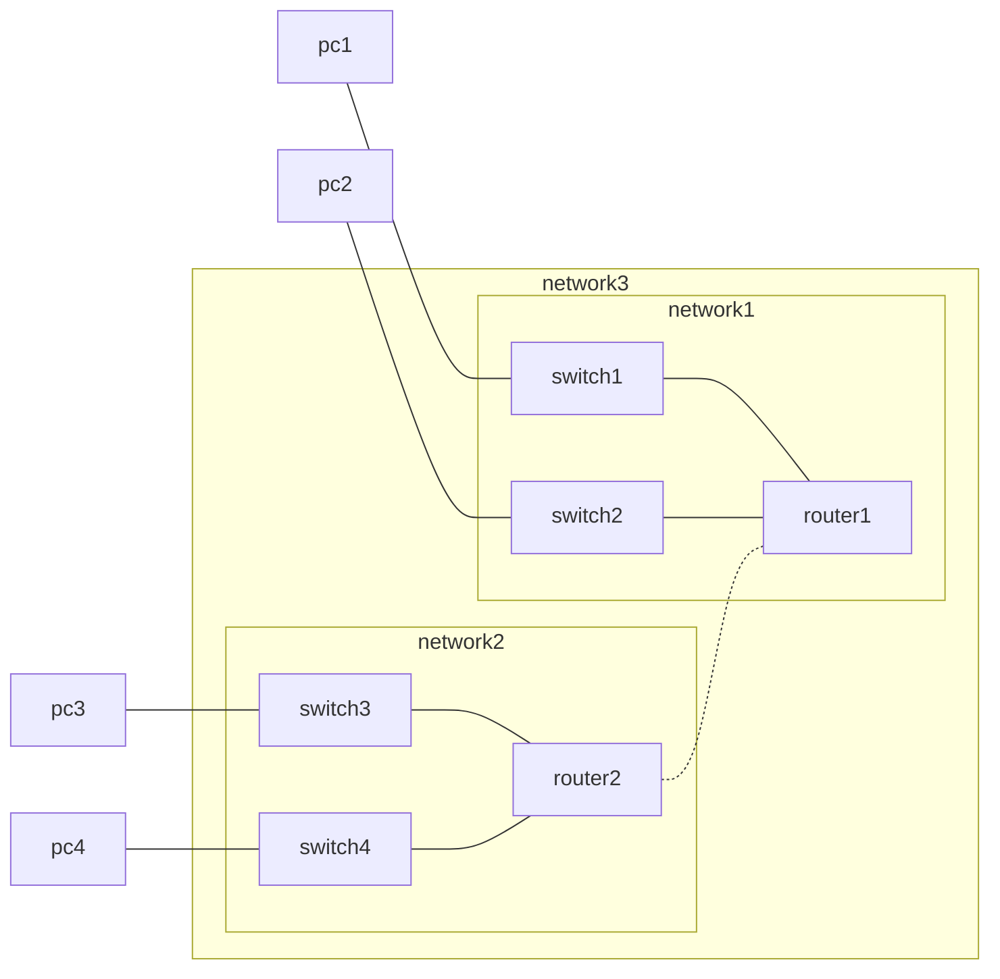
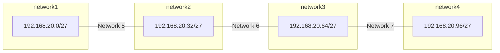

# Chapter 8 - Subnetting

[TOC]

## Subnetting

Subnetting is the act of dividing a network into smaller networks. This is done because:

* It improves performance
* Improves security
* Broadcasts are contained within their own network (subnet)

There can for example be different networks for students, faculty and admin networks. To keep information separated.

| Class | 1st Octet range               | 1st octet bits     | Network/host part | Subnet Mast   | Possible hosts |
| ----- | ----------------------------- | ------------------ | ----------------- | ------------- | -------------- |
| A     | 1-127 (127.x.x.x is loopback) | 00000000-011111111 | N.H.H.H           | 255.0.0.0     | 128 nets       |
| B     | 128-191                       | 1000000-10111111   | N.N.H.H           | 255.255.0.0   |                |
| C     | 192-223                       | 1100000-11011111   | N.N.N.H           | 255.255.255.0 |                |
| D     | 224-239                       | 11100000-11101111  | NA (multicast)    | -             |                |
| E     | 250-255                       | 11110000-11111111  | NA (experimental) | -             |                |

## Classful subnetting

| Address   | Subnet        | 1    | 2    | 3    | 4    |
| --------- | ------------- | ---- | ---- | ---- | ---- |
| 10.10.1.1 | 255.0.0.0     | 10   | 0    | 0    | 0    |
| 10.10.1.1 | 255.255.0.0   | 10   | 10   | 0    | 0    |
| 10.10.1.1 | 255.255.255.0 | 10   | 10   | 1    | 0    |

If the network IP address is the same as the address, it's on the same network. This way you can decide where to send packets. 

To find the network address, you add the device address to the subnet address. If it's the same, then it's on the same network.

| Address         | 1        | 2        | 3        | 4        |
| --------------- | -------- | -------- | -------- | -------- |
| 192.168.1.200   | 11000000 | 10101000 | 00000001 | 11001000 |
| 255.255.255.128 | 11111111 | 11111111 | 11111111 | 10000000 |
| 192.168.1.128   | 11000000 | 10101000 | 00000001 | 128      |

### Creating a subnet

#### Example 1

Using one bit

##### Network 1

| 1    | 2    | 3    | 4         | Address     |
| ---- | ---- | ---- | --------- | ----------- |
| 192  | 168  | 1    | 0000 0000 | 192.168.1.0 |

##### Network 2

| 1    | 2    | 3    | 4         | Network       |
| ---- | ---- | ---- | --------- | ------------- |
| 192  | 168  | 1    | 1000 0000 | 192.168.1.128 |

#### Example 2

##### Network 1

Using two bits. Two bits are reserved for the subnet. `192.168.1.11 111111` would be a broadcast, because all host bits are `1`.

| 1    | 2    | 3    | 4 (space is subnet) | Address     |
| ---- | ---- | ---- | ------------------- | ----------- |
| 192  | 168  | 1    | 00 000000           | 192.168.1.0 |

##### Network 2

| 1    | 2    | 3    | 4 (space is subnet) | Address       |
| ---- | ---- | ---- | ------------------- | ------------- |
| 192  | 168  | 1    | 11 000000           | 192.168.1.192 |

### Eight subnets

## MAC vs IP address

MAC addresses are used when communicating between devices within the same network. IP addresses go outside the network. Devices get the MAC address of a device by sending an ARP request.

## Variable Length Subnet Masks (VLSM)

Traditional Subnet masking wastes hosts, because sometimes you want some hosts to be bigger than others.

## Design considerations IPv6

A IPv6 address consists of 128 bits, 64 for network and 64 for host.

Creating a subnet is done by taking the last 16 bits of the network address, that becomes your subnet ID.