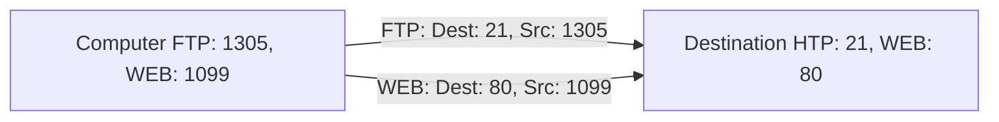

# Chapter 9 - Transport Layer

[TOC]

## Transport layer

### Role

* Responsible for creating a session between two applications and send data between them
* Provides connection-oriented data steam support

### responsibilities

* Track individual conversations
* Segment Data and Reassemble Segments
* Identify the Applications

### Conversion Multiplexing

* Segments data into smaller chunks
* Label data chunks to the conversation

## Transport layer Reliability

* Two protocol's
  * TCP
  * UDP
* TCP supports reliability while UDP doesn't.

#### TCP

Better for when you need to make sure all the data had been send successfully.

* Check's whether or not a packet has been delivered correctly
* Numbers and tracks data segments
* Retransmitting any unacknowledged data after a certain period of time.
* Reliable
* Acknowledges data
* Resends lost data
* Delivers data in sequenced order

#### UDP

Better for live data, like steaming video live or IP telephony

* Does not check whether or not data has been received.
* Fast
* Low overhead
* Does not require acknowledgements
* Does not resend lost data
* Delivers data as it arrives

## Ports (TCP, UDP)

### Ports

#### Common Ports

| Port | Description |
| ---- | ----------- |
| 80   | http        |
| 443  | https       |
| 21   | ftp         |

#### Port Addressing

When creating a request, the applications creates a random port number, so the segments know where to go when the application receives data.



```sequence
Client -> FTP: Dest: 21, src: 1305
note over FTP: Send's the data back to port 1305
FTP -> Client: Dest: 1305, src: 21

Client -> WEB: Dest: 80, src: 1099
note over WEB: Send's the data back to port 1305
WEB -> Client: Dest: 1099, src: 80
```


##### Socket

A socket is a combination of an IP address and a port. For example: `192.168.0.10:8887`

### TCP

#### Three-way handshake (start session)

```sequence
A -> B: Send SYN with SEQ=100, CTL=SYN
note over B: SYN Recived
B -> A: Send SYN and ACK (SEQ=300, ATK=101)
note over A: SYN, ACK recived
A -> B: Connection established (SEQ=101, ACK=301 CLT=ACK)
```

* `SYN` a sync bit
* `SEQ` a sequence number
* `ACK` acknowledgement

##### Step

* A send B an `syn` along side with a `seq` number.

#### TCP Finish

```sequence
A -> B: Send FIN
note over B: FIN recieved
B -> A: Send ACK
note over A: ACK recieved
B -> A: Send FIN
note over A: FIN recieved
A -> B: Send ACK
note over B: ACK recieved
```

##### Window Size

When a certain amount of bytes is received, then send an `ACK`. Because sending `ACK` every time a segment is received, would be a lot of data. The window size can be scaled when for example a network is unstable or really stable.

### UDP

* Segments of data, may be in the wrong order.