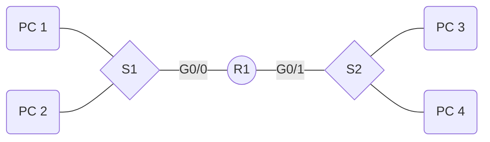

# Cisco Scenario 1 - Full Setup

[TOC]

## Hardware



What we need to do:

* Create 2 subnets (R1 to S1 and R1 to S2)
* Configure the two switches
  * Basic configuration
  * Console port configuration
  * VLAN Configuration
  * Save config
* Configure the router
  * Basic configuration
  * Console port configuration
  * VTY Configuration
  * Configure network interfaces
  * Save config

### Creating 2 subnets

First off, we take `192.168.1.0` as our base IP address and `255.255.255.0` as our subnet mask.

First of all, we need to find out how many subnets there are needed. In this case we need two: one between `R1` to `S1` and one between `R1` and `S2`. Because we need two, we need to reserve 2 bits, because $2^2 - 2$ is 2, because this is equal or grater than how many subnets we need. We need to write out the last octet of the subnet IP addresses to get the usable addresses. The `|` shows which section us used for the network and which for the hosts: `network|host`

| Subnet address last octet | Full IP Address | First usable address | Last usable address | Broadcast address |
| ------------------------- | --------------- | -------------------- | ------------------- | ----------------- |
| 00\|000000                | 192.168.1.0     | 192.168.1.1          | 192.168.1.62        | 192.168.1.63      |
| 01\|000000                | 192.168.1.64    | 192.168.1.65         | 192.168.1.126       | 192.168.1.127     |

Our new subnet mask will be `255.255.255.192` because if we write out the last octet in bits, we get `11|000000`.

We can now assign addresses to the different parts of the network.

| Part | Interface | Address                 |
| ---- | --------- | ----------------------- |
| R1   | G0/0      | 192.168.1.1             |
| R2   | G0/1      | 192.168.1.65            |
| S1   | vlan      | 192.168.1.2 (or no ip)  |
| S2   | vlan      | 192.168.1.66 (or no ip) |
| P1   | -         | 192.168.1.3             |
| P2   | -         | 192.168.1.4             |
| P3   | -         | 192.168.1.67            |
| P4   | -         | 192.168.1.68            |

### Switch

#### Basic configuration

First of all, we need to add some basic configuration like setting a `hostname`, `motd` and setting a password for the `enable` command. We set the default gateway to `192.168.1.1`, the ip address of the `G0/0` interface.

```cisco
Switch>en
Switch#conf t
Enter configuration commands, one per line.  End with CNTL/Z.
Switch(config)#hostname S1
S1(config)#enable secret cisco
S1(config)#banner motd "Some message"
S1(config)#ip default-gateway 192.168.1.1
```

#### Console port configuration

```cisco
S1(config)#line console 0
S1(config-line)#password cisco
S1(config-line)#login
S1(config-line)#exit
S1(config)#
```

#### VLAN Configuration

```cisco
S1(config)#interface vlan 1
S1(config-if)#ip address 192.168.1.2 255.255.255.192
S1(config-if)#no shutdown
S1(config-if)#
%LINK-5-CHANGED: Interface Vlan1, changed state to up

%LINEPROTO-5-UPDOWN: Line protocol on Interface Vlan1, changed state to up
exit
```

#### Save config

We need to encrypt passwords and save the config.

```cisco
S1(config)#service password-encryption
S1(config)#exit
S1#
%SYS-5-CONFIG_I: Configured from console by console
copy runn
S1#copy running-config st
S1#copy running-config startup-config 
Destination filename [startup-config]? 
Building configuration...
[OK]
S1#
```

### Router

#### Basic config

We need to do some basic configuration, like changing the `hostname` and adding a `banner`. Using `no ip domain-lookup`. This prevents the router from using DNS.

```cisco
Router>en
Router#conf t
Enter configuration commands, one per line.  End with CNTL/Z.
Router(config)#hostname R1
R1(config)#enable secret cisco
R1(config)#no ip domain-lookup
R1(config)#banner motd "Unauthorized access is strictly prohibited"
```

#### Command interface configuration

You need to configure the console interface (port) on your router so people can't just access it without a password.

```cisco
R1(config)#line console 0
R1(config-line)#password cisco
R1(config-line)#login
R1(config-line)#exit
```

#### Virtual Terminal Lines configuration

Configures the tellnet (and ssh) lines and assignes a password

```cisco
R1(config)#line vty 0 4
R1(config-line)#password cisco
R1(config-line)#login
R1(config-line)#exit
```

#### Configure network interfaces

To enable other devices to use this router to send packets.

```cisco
R1(config)#interface gig0/0
R1(config-if)#description connection to S1
R1(config-if)#ip address 192.168.1.1 255.255.255.192
R1(config-if)#no shutdown

R1(config-if)#
%LINK-5-CHANGED: Interface GigabitEthernet0/0, changed state to up

%LINEPROTO-5-UPDOWN: Line protocol on Interface GigabitEthernet0/0, changed state to up
exit
R1(config)#int gig0/1
R1(config-if)#description connection to S2
R1(config-if)#ip address 192.168.1.65 255.255.255.192
R1(config-if)#no shutdown

R1(config-if)#
%LINK-5-CHANGED: Interface GigabitEthernet0/1, changed state to up

%LINEPROTO-5-UPDOWN: Line protocol on Interface GigabitEthernet0/1, changed state to up
exit
```

#### Save config

You need to encrypt the passwords. Then you need to save the config because the config is only saved in the RAM. To make sure your config doesn't disappear when you exit, you have to copy it to the `startup-config`.

```cisco
R1(config)#service password-encryption
R1(config)#exit
R1#copy running-config  startup-config 
Destination filename [startup-config]? 
Building configuration..
```

### PC

A pc on the network also need's an IP address. You can give it any IP Address within the range of that subnet that isn't used already. Furthermore, you also need to provide a subnet mask and a default gateway. The subnet mask is just the subnet mask for that subnet, as we calculated when we created the [subnet](#creating-2-subnets) (so in this case `255.255.255.192`). The default gateway is the IP address of the interface for that subnet, so PC's connected to the network which go's to interface `gig 0/0` would be `192.168.1.1` and for `gig0/1` it would be `192.168.1.65`.

