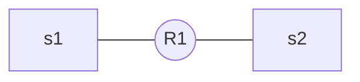

# Cisco Config

[TOC]

## Network



## Router

### Basic configuration

We need to do some basic configuration, like changing the `hostname` and adding a `banner`. Using `no ip domain-lookup`. This prevents the router from using DNS.

```cisco
Router>en
Router#conf t
Enter configuration commands, one per line.  End with CNTL/Z.
Router(config)#hostname R1
R1(config)#no ip domain-lookup
R1(config)#banner motd "Unauthorized access is strictly prohibited"
```

### Command interface configuration

You need to configure the console interface (port) on your router so people can't just access it without a password.

```cisco
R1(config)#enable password class
R1(config)#line console 0
R1(config-line)#password cisco
R1(config-line)#login
```

### Virtual Terminal Lines configuration

Configures the tellnet (and ssh) lines and assignes a password

```cisco
R1(config)#line vty 0 4
R1(config-line)#password cisco
R1(config-line)#login
R1(config-line)#exit
```

### Configure network interfaces

To tell the router where to send data to, basically tells the router what port it is.

```cisco
R1(config)#interface gig0/0
R1(config-if)#description connection to S1
R1(config-if)#ip address 192.168.1.1 255.255.255.0
R1(config-if)#no shutdown

R1(config-if)#
%LINK-5-CHANGED: Interface GigabitEthernet0/0, changed state to up

%LINEPROTO-5-UPDOWN: Line protocol on Interface GigabitEthernet0/0, changed state to up
exit
R1(config)#int gig0/1
R1(config-if)#description connection to S2
R1(config-if)#ip address 192.168.2.1 255.255.255.0
R1(config-if)#no shutdown

R1(config-if)#
%LINK-5-CHANGED: Interface GigabitEthernet0/1, changed state to up

%LINEPROTO-5-UPDOWN: Line protocol on Interface GigabitEthernet0/1, changed state to up
exit
```

### Save config

You need to encrypt the passwords. Then you need to save the config because the config is only saved in the RAM. To make sure your config doesn't disapear when you exit, you have to copy it to the `startup-config`.

```cisco
R1(config)#service password-encryption
R1(config)#exit
R1#copy running-config  startup-config 
Destination filename [startup-config]? 
Building configuration..
```