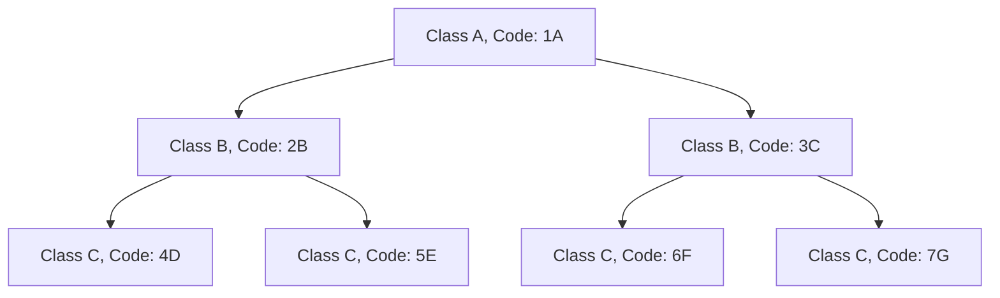

# Hands-on 4

## IP Types

## Network classes

| Class | Example       |
| ----- | ------------- |
| A     | 255.0.0.0     |
| B     | 255.255.0..0  |
| C     | 255.255.255.0 |

A class `A` network knows every `code` in the networks below it. 

### IPv4

Is 32 numeric address.

An IP Address is a combination of network addresses and host addresses.

| Subnet Mask     | Binary Subnet Mask                  | Number of available host bits | Number of available hosts |
| --------------- | ----------------------------------- | ----------------------------- | ------------------------- |
| 255.255.255.0   | 11111111.11111111.11111111.00000000 | 8                             | $2^8-2$                   |
| 255.255.240.0   | 11111111.11111111.11110000.00000000 | 12                            | $2^{12}-2$                |
| 255.255.255.252 | 11111111.11111111.11111111.11111100 | 2                             | $2^2-2$                   |
|                 |                                     |                               |                           |

### IPv6

An `IPv6` ip address is 128 bits long, which is often written in 32 hex characters. An example IPv6 address would be something like: `2001:0DB8:0001:0000:0000:0000:0000:0001` which consists of 8 _hextets_.

## Converting BITS, Decimal and HEX

### Decimal to HEX

To calculate the HEX value of a decimal number, you divide the number, for example `80` and divide it by `16`.
$$
80 / 16 = 5
$$
In this case, we get 5. So our HEX value is `50`.  But what if you have `91`? You can't divide `91` by `16`.
$$
91 / 16 = 5.6875
$$
In that case, you also need to calculate the modulus of the number:
$$
91 \% 16 = 11
$$
You need to convert `11` to a letter, which we can look up in this table:

| Character | Decimal value |
| --------- | ------------- |
| A         | 10            |
| B         | 11            |
| C         | 12            |
| D         | 13            |
| E         | 14            |
| F         | 15            |

In this case it's `B`, so our final HEX value would be `5B`.

### BITS to HEX

| 8    | 4    | 2    | 1    |
| ---- | ---- | ---- | ---- |
| 0    | 0    | 0    | 0    |

You take 4 bit's at a time and compare it to the table above. Lets say we have `1011`. To convert it, we first convert it to an decimal using the table:

| 8    | 4    | 2    | 1    |
| ---- | ---- | ---- | ---- |
| 1    | 0    | 1    | 1    |

Which gives us `11`. If we look this up in the HEX table we get `B`.