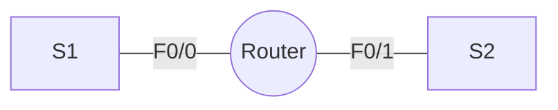
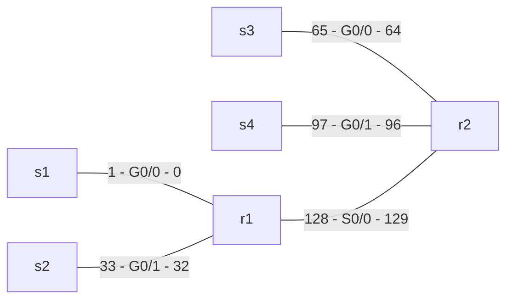

# Hands-on 6

## Creating a subnet with 100 hosts

| 0    | 0    | 0    | 0    | 0    | 0    | 0    | 0    |
| ---- | ---- | ---- | ---- | ---- | ---- | ---- | ---- |
| 128  | 64   | 32   | 16   | 8    | 4    | 2    | 1    |



### Config Router

We need to configure the interfaces: `F0/0` and `F0/1`.

```cisco
R1#interface F0/0
R1(interface)#ip add <subnet address> <subnet mask>
R1(interface)#no shut
R1(interface)#exit

R1#interface F0/1
R1(interface)#ip add <second subnet address> <subnet mask>
R1(interface)#no shut
R1(interface)#exit
```



