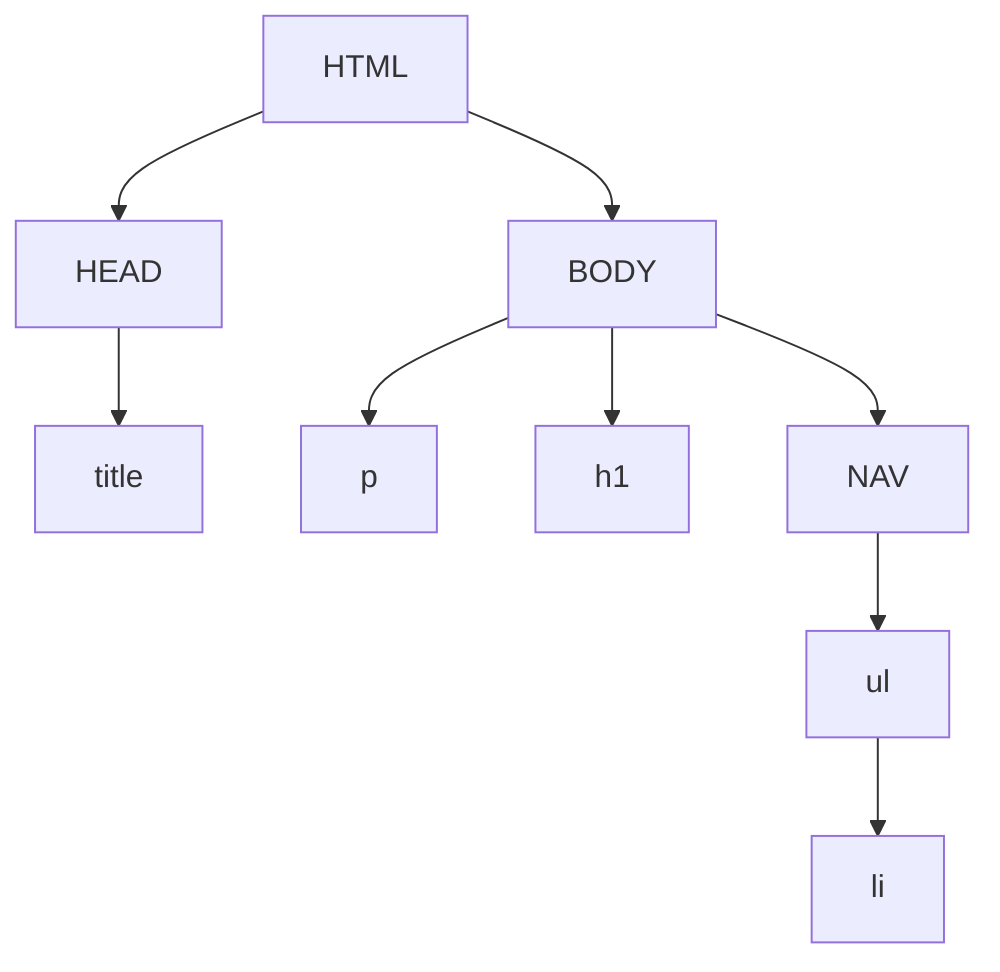

# Lecture 3

## DIV

Don't use div because it impacts readablilty.

## DOM



## Form

```html
<form
      action="apicall.asp"
      method="post"
      >
    <legend>
        Console Platforms
    </legend>
    <input
           id="xbox"
           name="consoleType"
           type="radio"
           value="xboxone"
	/>
</form>
```

### Input types

* color
* date
* email
* tel
* range
  * name
  * min
  * max

```html
<input type="<type>" />
```

## Look alike elements

### String vs b

```html
<strong>I'm bold</strong>
<b>I'm bold</b>
```

> Google gives more points to a `strong` element. Strong is important

### Italic vs emphasis

```html
<em>I'm emphasis</em>
<i>I'm Italic</i>
```

> It's al the same

### Favicon

```html
<link rel="icon" href="./path.png" type="image/png" />
```

> [https://validator.w3.org]()

### Audio

> Don't use `mp3` because it offically costs money to host so we use `ogg`

```html
<audio controls>
	<source src="./path.ogg" type="audio/ogg" />
    <source src="./path.mp3" type="audio/mpeg" />
</audio>
```

### Video

> Also use `ogg` for video

```html
<video controls>
	<source src="./path.mp4" type="video/mpeg" />
</video>
```

## Validation

[https://validator.w3.org]()

> ###### Sidenote
>
> You **must** use the validator in your projects