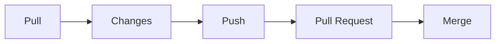

# Git Workflow

```mermaid
graph LR
	pull["Pull"]
	changes["Changes"]
	push["Push"]
	pullRequest["Pull Request"]
	merge["Merge"]
	
	pull --> changes --> push --> pullRequest --> merge
```

* `pull` pull down the 

## Issues

Issues have a couple of tags

* **Bug**, 
* **Improvement**, 
* **Feature**, 
* **Blocking**, 